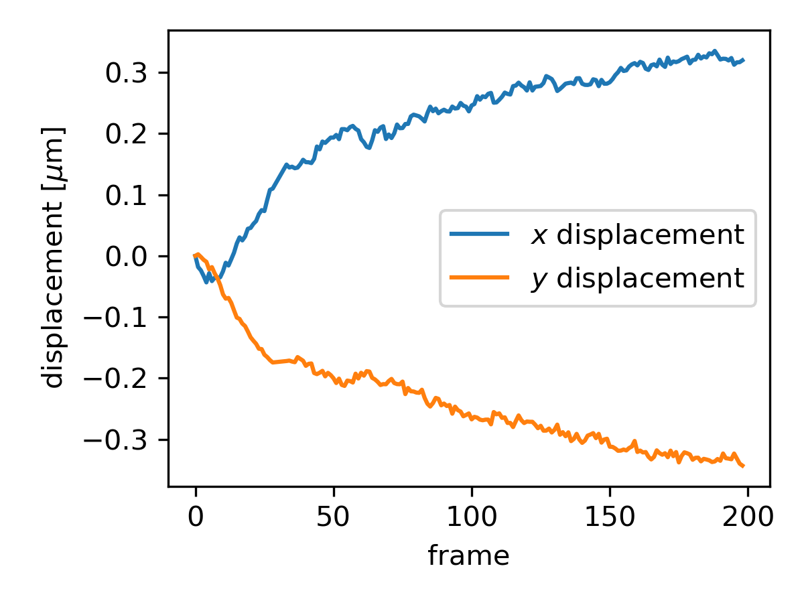

# Sub-pixel image registration using single particle tracking
A pipeline that combines SPT and Fourier shift to perform a sub-pixel registration on traction force microscopy and other fluorescence movies.

<div align="center">
  
Original TFM stack             |  Drift corrected stack
:-------------------------:|:-------------------------:
  |  
  
</div>

## Dependencies

To clone the repository, go to the folder of your choice and run in a terminal:

```bash
git clone https://github.com/remy13127/subpixel_registration_spt registration
```

In order to install the required python packages:

```bash
pip install -r requirements.txt
```

## Acquisition of tracks

The reference tracks are acquired using TrackMate, but any CSV table containing  position and a track ID should work. TrackMate’s LoGdetector applies a Laplacian of Gaussian filter, giving a strong response for gaussian-like spots of radius , which must be tuned to the average size of the beads.  For each object, the detector applies a Gaussian fit, which allows for the determination of a subpixel centroid. Once the objects of interest are detected, TrackMate’s LAP particle linking algorithm, which combines a nearest  neighbour  penalty  function  with  similitude  criteria (intensity, shape, size...), is used to connect the detections throughout the frames. The maximum linking distance is increased until most of the long tracks are no longer truncated. If the focus is lost on some frames, we can introduce enough tracking gaps to "jump" over the blurry frames. In the end, most of the tracks should be as long as the movie itself. A filter on the track length can be used at the last step to get rid of most of the spurious tracks. A CSV file containing the required information can be exported. 

⚠ On the latest TrackMate version, two additional line of alternate column labels are added at the beginning of the CSV table, please erase them before proceeding with the alignment.

## Alignment

```bash
python align.py
```

## Results

<div align="center">
  
Displacement field before interpolation             |  Interpolated displacement
:-------------------------:|:-------------------------:
  |  
  
</div>
